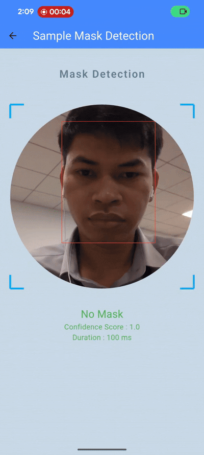

# Mask Detection

**Hello guys!**

Welcome to my blog. In this article, I want to share my exploration of a mask detection project developed with Flutter. 

<br>
<br>




<br>

If you would like to test it, please download the APK from the following link : 
[Download APK](https://tsfr.io/join/t6xts2?id=11139322)

---

<br>

## Technologies Used

- **Flutter**: Cross-platform UI framework for building the mobile application.
- **TensorFlow Lite**: Lightweight machine learning model framework for excecute model on device.
- **Mask Detection Model**: Existing ML Model public by https://github.com/Cindyalifia/tflite-face-mask-detection-android/
- **Google MLKit Face Detection**: Official Google ML for detect face from rgb image
- **Camera Plugin**: Flutter plugin (`camera`) for accessing device camera and capturing frames.

## Integrating the Model

For this project, I utilized a model available from [this GitHub repository](). The model is designed for face mask detection and is optimized for Android devices, making it suitable for integration into Kotlin via TensorFlow Lite.

Here is my native code for integration with Mask Detection Model :


***MaskDetector.kt***
```kotlin


class MaskDetector(private val context: Context) {

    companion object {
        private const val TAG = "MaskDetector"
    }

    private var model: Interpreter? = null
    private var imageProcessor: ImageProcessor? = null
    private val labels = listOf("WithMask", "WithoutMask")

    /**
     * Initialize the model and image processor
     * Call this once when starting the detector
     */
    fun initialize() : Boolean {
        try {
            val modelFile = FileUtil.loadMappedFile(context, "mask_detector.tflite")
            model = Interpreter(modelFile, Interpreter.Options())

            // Get input shape to create image processor
            val inputShape = model?.getInputTensor(0)?.shape()
            if (inputShape != null && inputShape.size >= 3) {
                imageProcessor = ImageProcessor.Builder()
                    .add(ResizeWithCropOrPadOp(inputShape[1], inputShape[2]))
                    .add(ResizeOp(inputShape[1], inputShape[2], ResizeOp.ResizeMethod.NEAREST_NEIGHBOR))
                    .add(NormalizeOp(127.5f, 127.5f))
                    .build()
            }
            
            Log.d(TAG, "Model initialized successfully")
            return true;
        } catch (e: Exception) {
            Log.e(TAG, "initialize() error: ${e.message}")
            return false;
        }
    }

    /**
     * Clean up resources
     * Call this when done with the detector
     */
    fun destroy():Boolean {
        try {
            model?.close()
            model = null
            imageProcessor = null
            Log.d(TAG, "Model destroyed successfully")
            return true;
        } catch (e: Exception) {
            Log.e(TAG, "destroy() error: ${e.message}")
            return false;
        }
    }

    /**
     * Detect mask from YUV image data (from Flutter camera)
     */
    fun detectMask(
        yuvBytes: ByteArray,
        width: Int,
        height: Int,
        rotation: Int,
        rect: FaceContour
    ): MaskDetectionResult? {
        try {
            // Check if model is initialized
            if (model == null) {
                Log.e(TAG, "Model not initialized. Call initialize() first.")
                return null
            }
            
            // Convert YUV to Bitmap
            val bitmap = yuv420ToBitmap(yuvBytes, width, height)
            
            // Rotate bitmap if needed
            val rotatedBitmap = if (rotation != 0) {
                rotateBitmap(bitmap, rotation.toFloat())
            } else {
                bitmap
            }

            // Get dimensions
            val bmpWidth = rotatedBitmap.width
            val bmpHeight = rotatedBitmap.height

            // Clamp coordinates to be within bitmap bounds
            val x = rect.left.coerceIn(0, bmpWidth - 1)
            val y = rect.top.coerceIn(0, bmpHeight - 1)
            val widthCrop = rect.width.coerceAtMost(bmpWidth - x)
            val heightCrop = rect.height.coerceAtMost(bmpHeight - y)

            val croppedFace = Bitmap.createBitmap(rotatedBitmap, x, y, widthCrop, heightCrop)


            // Predict mask
            val label = predict(croppedFace)

            val withMask = label["WithMask"] ?: 0f
            val withoutMask = label["WithoutMask"] ?: 0f

            val hasMask = withMask > withoutMask

            return MaskDetectionResult(
                hasMask = hasMask,
                withMaskScore = withMask,
                withoutMaskScore = withoutMask,
            )
            
        } catch (e: Exception) {
            Log.e(TAG, "detectMask() error: ${e.message}")
            return null
        }
    }

    /**
     * Convert YUV420 to Bitmap
     */
    private fun yuv420ToBitmap(yuvBytes: ByteArray, width: Int, height: Int): Bitmap {
        val yuvImage = YuvImage(yuvBytes, ImageFormat.NV21, width, height, null)
        val out = ByteArrayOutputStream()
        yuvImage.compressToJpeg(Rect(0, 0, width, height), 100, out)
        val imageBytes = out.toByteArray()
        return BitmapFactory.decodeByteArray(imageBytes, 0, imageBytes.size)
    }

    /**
     * Rotate bitmap
     */
    private fun rotateBitmap(bitmap: Bitmap, degrees: Float): Bitmap {
        val matrix = Matrix()
        matrix.postRotate(degrees)
        return Bitmap.createBitmap(bitmap, 0, 0, bitmap.width, bitmap.height, matrix, true)
    }

    /**
     * Run prediction on the input bitmap
     */
    private fun predict(input: Bitmap): MutableMap<String, Float> {
        val currentModel = model ?: throw IllegalStateException("Model not initialized")
        val currentProcessor = imageProcessor ?: throw IllegalStateException("Image processor not initialized")

        val imageDataType = currentModel.getInputTensor(0).dataType()
        val outputDataType = currentModel.getOutputTensor(0).dataType()
        val outputShape = currentModel.getOutputTensor(0).shape()

        var inputImageBuffer = TensorImage(imageDataType)
        val outputBuffer = TensorBuffer.createFixedSize(outputShape, outputDataType)

        inputImageBuffer.load(input)
        inputImageBuffer = currentProcessor.process(inputImageBuffer)

        currentModel.run(inputImageBuffer.buffer, outputBuffer.buffer.rewind())

        val labelOutput = TensorLabel(labels, outputBuffer)
        
        return labelOutput.mapWithFloatValue
    }
}

data class FaceContour (
    val left : Int,
    val top : Int,
    val width : Int,
    val height : Int
)


```


## Implementing Real Time Face Mask Detection

This project is developed using Flutter. To access native platform-specific features, such as predict mask, we utilize MethodChannel to communicate between Flutter and native code.


***MaskDetectorPlugin.kt***

```kotlin

/** MaskDetectorPlugin */
class MaskDetectorPlugin: FlutterPlugin, MethodCallHandler {
  /// The MethodChannel that will the communication between Flutter and native Android
  ///
  /// This local reference serves to register the plugin with the Flutter Engine and unregister it
  /// when the Flutter Engine is detached from the Activity
  private lateinit var channel : MethodChannel
  private var maskDetector : MaskDetector? = null
  private var TAG = "MaskDetector"
  private lateinit var context : Context

  override fun onAttachedToEngine(flutterPluginBinding: FlutterPlugin.FlutterPluginBinding) {
    context = flutterPluginBinding.applicationContext
    channel = MethodChannel(flutterPluginBinding.binaryMessenger, "com.lengdev.maskdetector")
    channel.setMethodCallHandler(this)
  }

  override fun onMethodCall(call: MethodCall, result: Result) {
        when (call.method) {
            "initialize" -> handleInitialize(call, result)
            "detectMask" -> handleDetectMask(call, result)
            "destroy" -> handleDestroy(call, result)
            else -> result.notImplemented()
        }
    }

    private fun handleDetectMask(call: MethodCall, result: Result) {
        
        val yuvBytes = call.argument<ByteArray>("yuvBytes") 
            ?: throw IllegalArgumentException("Missing yuvBytes")
        val width = call.argument<Int>("imageWidth") 
            ?: throw IllegalArgumentException("Missing width")
        val height = call.argument<Int>("imageHeight") 
            ?: throw IllegalArgumentException("Missing height")
        val rotation = call.argument<Int>("rotation") 
            ?: throw IllegalArgumentException("Missing rotation")
        val faceContour = call.argument<Map<String, Int>>("faceContour") ?: throw IllegalArgumentException("Missing faceBoundingBox")

        val left = faceContour["left"] ?: 0
        val top = faceContour["top"] ?: 0
        val right = faceContour["right"] ?: 0
        val bottom = faceContour["bottom"] ?: 0

        val faceBoundingBox = FaceContour(
            left = left,
            top = top,
            width = right - left,
            height = bottom - top
        )

        // Perform heavy mask detection
        val response = maskDetector?.detectMask(
            yuvBytes, 
            width, 
            height, 
            rotation,
            faceBoundingBox
        )

        if(response == null){
            result.error("PREDICTION_ERROR", "Detect mask failed", null)
        }else {
            result.success(mapOf(
                "hasMask" to response.hasMask,
                "withMaskScore" to String.format("%.4f", response.withMaskScore).toDouble(),
                "withoutMaskScore" to String.format("%.4f", response.withoutMaskScore).toDouble(),
            ))

        }
        
    }
    fun handleInitialize(call: MethodCall, result: Result){

        if(maskDetector != null){
            maskDetector?.destroy()
            maskDetector = null
        }

        maskDetector = MaskDetector(context)
        val status = maskDetector?.initialize()

        if(status == true){
            result.success(mapOf(
                "status" to true,
                "message" to "Initialize mask detector success!."
            ))
        }else {
            result.error("INITIALIZE_FAIL","Failed to initialize mask detector!.",null)
        }


    }

    fun handleDestroy(call: MethodCall, result: Result){
        if(maskDetector != null){
            val status = maskDetector?.destroy()
            if(status == true){
                result.success(mapOf(
                    "status" to true,
                    "message" to "Mask detector was destroyed!."
                ))
            }else {
                result.error("DESTROY_FAILED","Failed to destroy mask detector!.",null)
            }
        }else {
            result.error("DESTROY_FAILED","Failed to destroy mask detector!.",null)
        }
    }

    override fun onDetachedFromEngine(binding: FlutterPlugin.FlutterPluginBinding) {
        channel.setMethodCallHandler(null)
    }
}


```
<br>
<br>


***mask_detector.dart***
```dart


class MaskDetector {
  
  static Future<Map<String, dynamic>> initialize() {
    return MaskDetectorPlatform.instance.initialize();
  }


  static Future<MaskDetectionResult> detect(Uint8List yuvBytes,{
    required double imageWidth,
    required double imageHeight,
    required Rect faceCountour,
    int rotation = 0,
  }) {
    return MaskDetectorPlatform.instance.detectMask(
      yuvBytes,
      imageHeight: imageHeight,
      imageWidth: imageWidth,
      faceCountour: faceCountour,
      rotation: rotation
    );
  }

  static Future<Map<String, dynamic>> destroy() {
    return MaskDetectorPlatform.instance.destroy();
  }

}


```

***mask_detection_view.dart***

```dart

class MaskDetectionView extends StatefulWidget {
  const MaskDetectionView({super.key});

  @override
  State<MaskDetectionView> createState() => _MaskDetectionViewState();
}

class _MaskDetectionViewState extends State<MaskDetectionView> {

  MaskDetectionResult? _maskResult;
  Size? _screenSize;
  late FaceDetector _faceDetector;
  bool isNoFaceDetected = true;
  bool _maskDetectorInitialized = false;
  CustomPaint? _customPaint;
  bool _isWidgetDestroyed = false;
  String? _processDuration;


  final GlobalKey<CameraViewState> _cameraViewKey = GlobalKey();

  void _handleDetectMask(CameraStreamPayload payload) async {
    
    if(_isWidgetDestroyed) return;
    
    final startAt = DateTime.now();
    try {

      final faces = await _faceDetector.processImage(payload.inputImage);
      if(faces.isEmpty) {
        isNoFaceDetected = true;
        throw Exception("No face detected");
      }

      isNoFaceDetected = false;

      final bx = faces[0].boundingBox;

      final faceContour = Rect.fromLTRB(bx.left, bx.top, bx.right,bx.bottom);

      final painter = FaceDetectorPainter(
        faces,
        Size(payload.cameraImage.width.toDouble(), payload.cameraImage.height.toDouble()),
        payload.inputImage.metadata!.rotation,
        CameraLensDirection.front
      );
      _customPaint = CustomPaint(painter: painter);

      _maskResult = await MaskDetector.detect(
        payload.yuvBytes,
        imageWidth: payload.imageWidth.toDouble(),
        imageHeight: payload.imageHeight.toDouble(),
        faceCountour: faceContour,
        rotation: payload.rotation
      );
      log("data : $_maskResult");
      _processDuration = "${DateTime.now().difference(startAt).inMilliseconds} ms";
    }
    catch (e){
      _maskResult = null;
      _processDuration = null;
      log("Error while detect mask : $e");
    } finally {
      setState(() {});
    }
  }

  void _initDetection() async {
    
    _faceDetector = FaceDetector(
      options: FaceDetectorOptions(
        performanceMode: FaceDetectorMode.accurate,
        minFaceSize: 0.3
      ),
    );

    final result = await MaskDetector.initialize();
    _maskDetectorInitialized = result['status'] ?? false;

    setState(() {});
  }

  @override
  void initState() {
    super.initState();
    _initDetection();
  }

  @override
  void dispose() {
    _isWidgetDestroyed = true;
    super.dispose();
    MaskDetector.destroy();
    _faceDetector.close();
  }


  @override
  Widget build(BuildContext context) {

    if(!_maskDetectorInitialized) {
      return Scaffold(
        body: Center(
          child: Text("Failed to initialize mask detector!."),
        ),
      );
    }

    _screenSize = MediaQuery.of(context).size;
    return Scaffold(
      appBar: AppBar(
        title: Text("Sample Mask Detection",style: TextStyle(color: Colors.white)),
        backgroundColor: Colors.blueAccent,
      ),
      backgroundColor: Color(0xFFC7D9E9),
      body: SafeArea(
        child: Column(
          children: [
            const SizedBox(height: 40),
            const Text(
              "Mask Detection",
              style: TextStyle(
                fontSize: 20,
                fontWeight: FontWeight.w600,
                color: Colors.blueGrey,
                letterSpacing: 2
              ),
            ),
            const SizedBox(height: 50),
            Center(
              child: SizedBox(
                width: _screenSize!.width * .9,
                height: _screenSize!.width * .9,
                child: CameraView(
                  key: _cameraViewKey,
                  onImage: _handleDetectMask,
                  customPaint: _customPaint,
                  cameraStreamProcessDelay: const Duration(milliseconds: 200),
                ),
              ),
            ),
            const SizedBox(height: 40),
            _buildResponse()
          ],
        ),
      ),
    );
  }
  Widget _buildResponse(){
    if(isNoFaceDetected){
      return Text(
        "No face detected!.",
        style: TextStyle(
          color: Colors.red,
          fontSize: 20
        ),
    );
    }
    if(_maskResult == null) return SizedBox.shrink();
    String msg = _maskResult!.hasMask ? "Has Mask" : "No Mask";
    Color color = _maskResult!.hasMask ? Colors.red : Colors.green;
    return Column(
      children: [
        Text(
          msg,
          style: TextStyle(
            color: color,
            fontSize: 20
          ),
        ),
        Text(
          "Confidence Score : ${_maskResult!.hasMask ? _maskResult!.withMaskScore : _maskResult!.withoutMaskScore}",
          style: TextStyle(
            color: color
          ),
        ),
        if(_processDuration != null)
          Text(
            "Duration : $_processDuration",
            style: TextStyle(color: Colors.green),
          )
      ],
    );
  }
}
```

## Conclusion
In this blog, I aimed to share my exploration of Mask Detection, which can be helpful for KYC processes involving user face verification, such as Liveness Detection and Face Recognition. Unfortunately, I have not yet implemented this functionality on iOS. However, I plan to do so in the future when time permits, to support iOS devices.

<br>
You can find full implement source code in repo :

[https://github.com/horlengg/mask_detector](https://github.com/horlengg/mask_detector)

Thank for reading!.